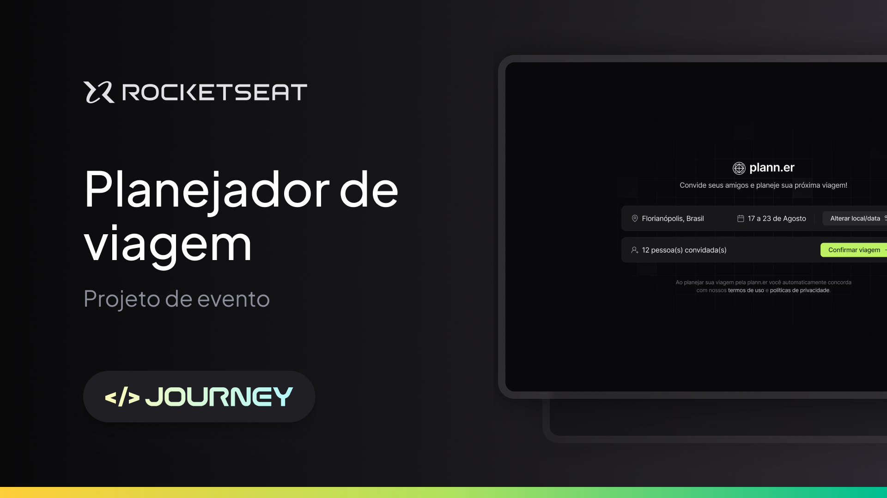

# Plann.er

## 💻 About:

Plan a trip with your friends using Plann.er

## 📝 Layout


*[Trip Planner Figma](https://www.figma.com/design/gb3JvH86aaJxOWaIQaMXnm/NLW-Journey-%E2%80%A2-Planejador-de-viagem-(Community)?node-id=3-376&m=dev)

## 🚀 Starting

These instructions will allow you to obtain a copy of the working project on your local machine for development and testing purposes.

### 🔧 Installation

Inside the VsCode terminal write the following code

```
git init
```

```
git clone https://github.com/Gabrielingnau/My-Portfolio
```
Then intade the dependencies with

```
npm install
```

Then just run the project with

```
npm run dev
```

### 🚧 Running the BackEnd (server)

```bash
# Download from the repository
$https://github.com/mewerton/FoodExplorer_BackEnd
```

## 🛠️ Built with

* [React.js](https://react.dev/) - The library for user interfaces
* [Vite](https://vitejs.dev/) - FrontEnd Tool
* [Typescript](https://www.typescriptlang.org/) - Syntax for types
* [Tailwind](https://tailwindcss.com/) - CSS 

---
⌨️ with ❤️ by [Gabriel Lingnau](https://www.linkedin.com/in/gabriel-lingnau-3bb17b266/) 😊